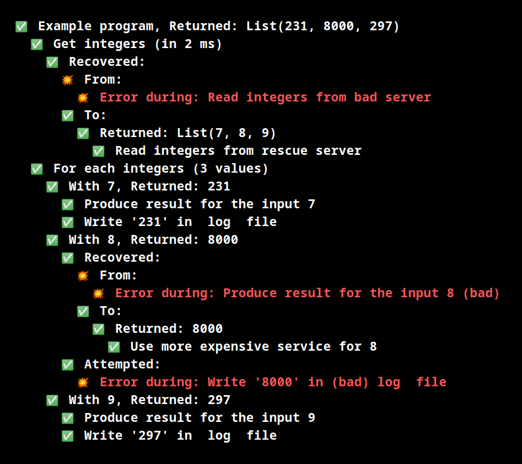

# Cats MTL Chronicle over Cats IO

This is a PoC/experimentation for Cats MTL Chronicle with Cats IO for producing a tree log.

I use:
- [Cats IO](https://typelevel.org/cats-effect/datatypes/io.html)
- [Cats MTL Chronicle](https://typelevel.org/cats-mtl/mtl-classes/chronicle.html)

Some operators are inspired by [Treelog](https://github.com/lancewalton/treelog) ([documentation](http://lancewalton.github.io/treelog/latest/api/treelog/index.html))

The types I used with the `Chronicole[F[], E]` are:
- `IO` for the effect `F[_]`.
- `LOG` for the accumulating `E`.
```scala
type LOG = List[LogNode]
```

The `LogNode` type is just for defining a tree:
```scala
case class LogNode(
  value:    LogItem, 
  children: List[LogNode] = Nil
)
```

`LogItem` has only two parts:
```scala
sealed trait LogItem

case class LogMsg(s: String, ok: Boolean = true) extends LogItem
case class LogErr(ex: Throwable)                 extends LogItem
```

The `CIO` type is for **C**hronicle **IO**:
```scala
type CIO[A] = IorT[IO, LOG, A]

private val C = MonadChronicle[CIO, LOG]
```

With some customizations of `Concurrent[CIO]`.

# Exemple

I will use some helper function to simulate business code:
```scala
def doThat(s: String): CIO[String] =
  if (s.contains("bad"))
    fromIO(IO.raiseError(new Throwable(s"Error during: $s")))
  else 
    CIO.msg(s).as(s)

def badIfEven(i: Int) : String =
  if (i % 2 === 0) "(bad)" else ""
```

Exemple program:
```scala
("Exemple program" ~~< {
  for {
    ints <- "Get integers" ~~< {
      doThat("Read integers from bad server").as(List(1, 2, 3))
        .handleErrorWith(_ => doThat("Read integers from rescue server").as(List(7, 8, 9)).valued)
    }

    rs <- ("For each integers" ~*< ints) { i =>
      s"With $i" ~<<
        doThat(s"Produce result for the input $i ${badIfEven(i)}")
          .as(i * 33)
          .handleErrorWith(ex => doThat(s"Use more expensive service for $i").as(i * 1000).valued)
          .flatTap(v => doThat(s"Write '$v' in ${badIfEven(v)} log  file").attempt)
    }
  } yield rs
}).valued
```

Produce:

